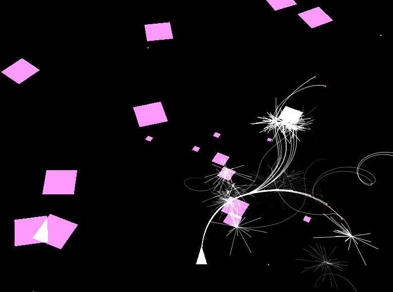

rym
===

> A game about beauty, explosions, lines, squares and a triangle.


About the game
--------------

This game is dear to me. I started working on it in 2008 *by accident* when
I was just fooling around. The game in it self is nothing special, it is kind
of beautiful and meditative. And because it is so easy to work with I have
created ports for it to almost every platform that I've used. (Files for
building on these platforms is not included in this project).

In 2020-2021 I did a push to convert the whole project to c++20 modules, and
that will probably make compilation to other platforms more difficult for the
nearest future.

Build on ubuntu
---------------

install matmake2

```http
https://github.com/Laserskold/matmake2
```

install clang-11
```bash
wget https://apt.llvm.org/llvm.sh
chmod +x llvm.sh
sudo ./llvm.sh 11
```


install SDL2

```bash
sudo apt install libsdl2-dev
```

Build with
```
matmake2 --target clang
```

Install on android
------------------

If you search for rym on google play stor you should probably find a installer.



